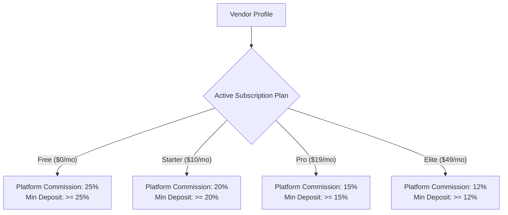
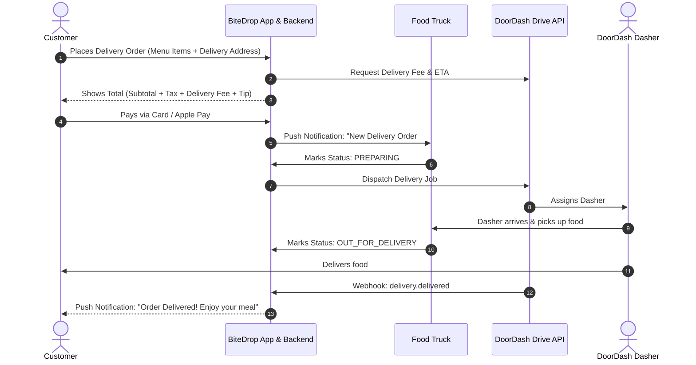
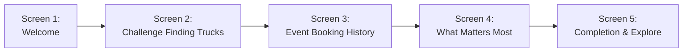
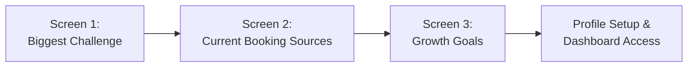

# BiteDrop — New Client Requirements & Additions Breakdown

This document provides a detailed breakdown of all the **new items, features, and architectural additions** introduced by the client in the latest update (including attached visual references).

---

## 1. Executive Summary of New Additions

The client introduced **5 major feature areas and extensions**:

1. **Dynamic Tier-Based Commission Matrix (Replaces Flat 20%)**:
   - Replaces the previous static 20% platform commission with a dynamic rate based on the vendor's active subscription tier ($12\%$ to $25\%$).
2. **Food Ordering Module (Pickup & Third-Party DoorDash Delivery)**:
   - Expansion beyond event bookings to support direct menu ordering, in-app customer payments, truck pickup, and on-demand delivery via DoorDash Drive API.
3. **Dual Leaderboards & Gamification**:
   - Two separate ranking systems: **Food Trucks** (performance, check-ins, bookings) and **Food Lovers** (QR check-ins, loyalty points, activity).
4. **Food Lover (Foodie) Onboarding Survey (5-Step Flow)**:
   - Structured user preference questionnaire to capture pain points, booking interests, and value motivations before account activation.
5. **Food Truck Owner (Vendor) Onboarding Survey (3-Step Flow)**:
   - Business profiling questionnaire capturing marketing channels, current booking sources, and growth bottlenecks.

---

## 2. Detailed Breakdown of Each New Addition

### 🆕 Addition 1: Vendor Pricing & Tier-Based Stripe Commission

* **Previous State**: Fixed 20% commission on all event booking quotes across the platform.
* **New Requirement**: The platform must inspect the vendor's active subscription tier and apply a tier-specific commission rate and minimum deposit rule.

#### Comparison Matrix:
| Subscription Plan | Monthly Fee | Platform Commission | Example ($1,000 Booking) | BiteDrop Revenue | Vendor Net Earnings |
| :--- | :--- | :--- | :--- | :--- | :--- |
| **Free** | $0 | **25%** | $1,000 | **$250** | **$750** |
| **Starter** | $10 | **20%** | $1,000 | **$200** | **$800** |
| **Pro** | $19 | **15%** | $1,000 | **$150** | **$850** |
| **Elite** | $49 | **12%** | $1,000 | **$120** | **$880** |

---

### 🆕 Addition 2: Online Food Ordering (Pickup & DoorDash Delivery)

* **Previous State**: Platform only handled Event Bookings (Catering, Private Parties, Festivals).
* **New Requirement**: Support direct food ordering from food trucks with two fulfillment models:
  1. **Pickup**: Customer places order in app $\rightarrow$ pays via Stripe $\rightarrow$ food truck prepares order $\rightarrow$ customer picks up at truck window.
  2. **Delivery**: Customer places delivery order in app $\rightarrow$ pays food + delivery fee + tip $\rightarrow$ Bite Drop calls **DoorDash Drive On-Demand API** to dispatch a driver $\rightarrow$ driver picks up from truck and delivers to customer.

---

### 🆕 Addition 3: Dual Leaderboards (Food Trucks & Food Lovers)

* **Previous State**: Food truck leaderboards (top-rated, most-booked, most-visited, trending).
* **New Requirement**: Add dedicated rankings for **Food Lovers (Customers)** to gamify participation.

#### Ranking Structure:
1. **Food Truck Rankings**:
   - **Top Rated**: Average review rating $\times$ review count confidence weight.
   - **Most Booked**: Total confirmed event bookings.
   - **Most Visited**: Unique verified QR check-ins.
   - **Trending**: 14-day velocity of check-ins, favorites, and bookings.
2. **Food Lover Rankings**:
   - **Top Foodies**: Total Bite Drop loyalty points earned.
   - **Check-In Champions**: Verified truck visits and QR scans.
   - **Community Champions**: Top contributors in the social feed, comments, and reviews.

---

### 🆕 Addition 4: Food Lover (Customer) Onboarding Questionnaire

* **New Requirement**: A 5-step interactive onboarding questionnaire for new food lovers before using the app.

#### Captured Data Points:
- `hardestPart` (multi-select up to 2):
  - Knowing where they are
  - Knowing when they're open
  - Finding ones I'll actually like
  - Keeping up with my favorites
- `eventBookingHistory` (single-select):
  - Yes – definitely
  - A few times
  - Not yet, but I might
  - I'm just here to find food
- `valueDrivers` (multi-select):
  - Finding trucks near me
  - Booking trucks for events
  - Earning rewards
  - Following my favorite trucks
  - Discovering new trucks

---

### 🆕 Addition 5: Food Truck Owner (Vendor) Onboarding Questionnaire

* **New Requirement**: Business profiling survey during vendor onboarding to collect pain points, current booking sources, and growth goals.

#### Captured Data Points:
- `biggestChallenge` (multi-select up to 2):
  - Getting discovered by new customers
  - Finding more events & booking opportunities
  - Keeping customers coming back
  - Promoting where I'll be
- `currentBookingSources` (single-select):
  - Social media
  - Word of mouth
  - Calls, texts, or DMs
  - Booking websites or platforms
  - I don't receive many booking requests yet
- `growthGoals` (multi-select):
  - More visibility & customers
  - More event bookings
  - More followers & repeat customers
  - An easier way to manage my truck online

---

## 3. Implementation Phasing Strategy

| Component | Phase 1 (Launch Target) | Phase 2 (Post-Launch Expansion) |
| :--- | :--- | :--- |
| **Tier-Based Commission (25%, 20%, 15%, 12%)** | ✅ Implement dynamic rate lookup in `PaymentsService` | Automated subscription billing via Stripe Billing |
| **Onboarding Surveys (Customer & Vendor)** | ✅ Store JSON survey responses in database | ML-powered personalized recommendation feed |
| **Dual Leaderboard System** | ✅ Activate ranking queries for Trucks & Foodies | Monthly leaderboard reward badges & credit bonuses |
| **Food Ordering: Pickup** | 🗄️ Database schemas & menu items ready | Order management dashboard & pickup status push |
| **Food Ordering: DoorDash Delivery** | 🗄️ Delivery models & geofencing ready | DoorDash Drive API production integration & webhook dispatch |
