# BiteDrop Current Booking Flow

This is the single end-to-end booking flow implemented by the current NestJS codebase. It combines direct food-truck bookings, public community requests, private truck requests, Stripe Connect payments, and refunds.

```mermaid
flowchart TB
    Start([Authenticated customer starts a booking]) --> Entry{Booking entry point}

    subgraph Direct[Direct food-truck booking]
        D1["POST /api/v1/bookings"] --> D2["Validate future time window<br/>active truck and guest capacity<br/>menu ownership and PostGIS service area<br/>no active booking or unexpired hold overlap"]
        D2 --> D3{Valid request?}
        D3 -- No --> DError[4xx validation error]
        D3 -- Yes --> DPending["Create Booking: PENDING<br/>Notify vendor"]
        DPending --> DDecision{Vendor action}
        DDecision -- Reject --> DRejected["PATCH /api/v1/bookings/:id/reject<br/>Booking: REJECTED"]
        DDecision -- Accept first --> DAccepted["PATCH /api/v1/bookings/:id/accept<br/>Booking: ACCEPTED"]
        DDecision -- Quote directly --> DQuote
        DAccepted --> DQuote["POST /api/v1/bookings/:id/quotes<br/>Validate amount, expiry, overlap,<br/>and deposit against configured commission rate"]
        DQuote --> DQuoted["Create BookingQuote: PENDING<br/>Booking: QUOTED<br/>Notify customer"]
        DQuoted -- Vendor rejects booking --> DRejected
        DQuoted --> DQuoteDecision{Customer accepts valid quote?}
        DQuoteDecision -- No or expired --> DNoPayment[No payment transition]
        DQuoteDecision -- Yes --> DPaymentPending["PATCH /api/v1/bookings/quotes/:quoteId/accept<br/>Quote: ACCEPTED<br/>Booking: PAYMENT_PENDING<br/>Create 5-120 minute hold, default 30<br/>Award booking points and notify vendor"]
    end

    subgraph Community[Community request and vendor offer]
        CPublic["POST /api/v1/community/requests<br/>Request: OPEN and visible to vendors"]
        CPrivate["POST /api/v1/community/food-trucks/:truckId/requests<br/>Request: OPEN and visible to target truck"]
        CPublic --> COffer
        CPrivate --> COffer["POST /api/v1/community/requests/:id/offers<br/>Validate vendor ownership, visibility,<br/>amount, expiry, and deposit rule"]
        COffer --> CPending[VendorOffer: PENDING]
        CPending --> CDecision{Offer action}
        CDecision -- Customer rejects --> CRejected[VendorOffer: REJECTED]
        CDecision -- Vendor withdraws --> CWithdrawn[VendorOffer: WITHDRAWN]
        CDecision -- Customer accepts --> CAccepted["PATCH /api/v1/community/offers/:offerId/accept<br/>Selected offer: ACCEPTED<br/>Other pending offers: REJECTED<br/>Request: MATCHED"]
        CAccepted --> CPaymentPending["Create Booking: PAYMENT_PENDING<br/>Copy accepted offer financials<br/>Create 30-minute hold"]
    end

    Entry -- Direct profile --> D1
    Entry -- Public community request --> CPublic
    Entry -- Private targeted request --> CPrivate

    DPaymentPending --> PaymentReady
    CPaymentPending --> PaymentReady

    subgraph Payment[Shared Stripe Connect payment flow]
        PaymentReady[Booking: PAYMENT_PENDING] --> P1["POST /api/v1/payments/bookings/:bookingId/payment-intent"]
        P1 --> P2["Validate customer ownership, idempotency,<br/>no successful or active payment,<br/>and vendor Connect account"]
        P2 --> P3{Payment can start?}
        P3 -- No --> PError[4xx error or existing idempotent result]
        P3 -- Yes --> P4["Create Payment: PENDING<br/>Resolve deposit or full charge<br/>Create Stripe destination PaymentIntent"]
        P4 --> P5[Payment: PROCESSING]
        P5 --> StripeEvent{Verified Stripe webhook}
        StripeEvent -- payment_intent.succeeded --> PSuccess["Payment: SUCCEEDED<br/>Booking: CONFIRMED<br/>Record commission and pending payout<br/>Notify customer and vendor"]
        StripeEvent -- payment_intent.payment_failed --> PFailed["Payment: FAILED<br/>Booking remains PAYMENT_PENDING"]
        StripeEvent -- payment_intent.canceled --> PCancelled["Payment: CANCELLED<br/>Booking remains PAYMENT_PENDING"]
    end

    PSuccess --> RefundChoice{Vendor requests refund?}

    subgraph Refund[Refund flow]
        RefundChoice -- No --> Confirmed([Confirmed booking])
        RefundChoice -- Yes --> R1["POST /api/v1/payments/:paymentId/refunds<br/>Only the owning vendor and a SUCCEEDED payment"]
        R1 --> R2[Create Stripe refund and local Refund record]
        R2 --> REvent{Stripe refund webhook}
        REvent -- Partial success --> RPartial["Payment: PARTIALLY_REFUNDED<br/>Booking status unchanged"]
        REvent -- Full success --> RFull["Payment: REFUNDED<br/>Booking status unchanged"]
        REvent -- Failure --> RFailed["Refund: FAILED<br/>Payment status unchanged"]
    end

    classDef success fill:#d9f2e6,stroke:#177245,color:#12382a;
    classDef terminal fill:#f5dddd,stroke:#a33a3a,color:#4d1717;
    classDef external fill:#e5eefb,stroke:#3567a8,color:#183754;
    class PSuccess,Confirmed success;
    class DError,DRejected,CRejected,CWithdrawn,PError,PFailed,PCancelled,RFailed terminal;
    class P4,P5,StripeEvent,R2,REvent external;
```

## Current Implementation Boundaries

- The commission and minimum deposit use `PLATFORM_COMMISSION_RATE`; they are not hard-coded in this flowchart.
- A hold stops overlapping bookings only while its `expiresAt` is in the future. There is currently no job that changes an unpaid `PAYMENT_PENDING` booking to `CANCELLED` or `EXPIRED` when the hold expires.
- Community offer acceptance currently creates a booking and hold without running the direct-booking service-area and overlap checks.
- Stripe payment failure or cancellation changes the payment status only; the booking remains `PAYMENT_PENDING`.
- A successful refund changes the payment/refund records only; it does not cancel the booking or reverse its commission/payout record.
- `IN_PROGRESS`, `COMPLETED`, `CANCELLED`, and `EXPIRED` exist in the booking schema, but the current booking controller exposes no lifecycle endpoints that move a confirmed booking into those states.
