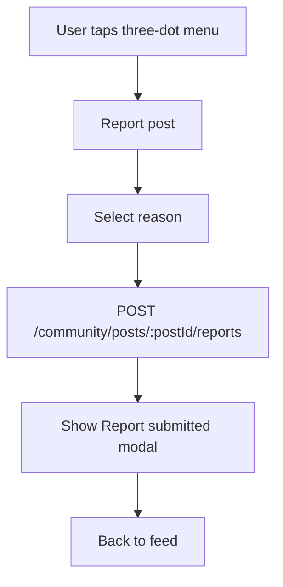
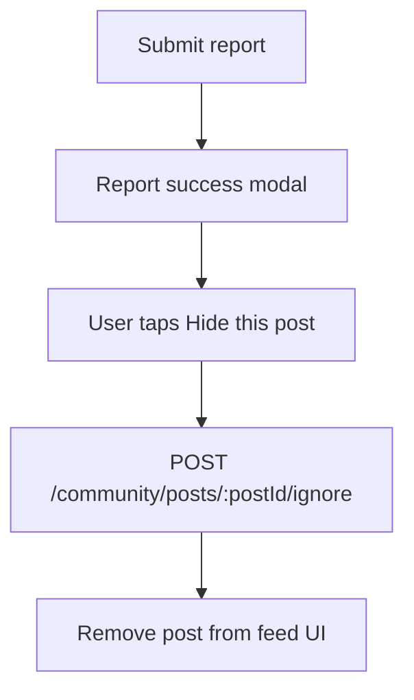
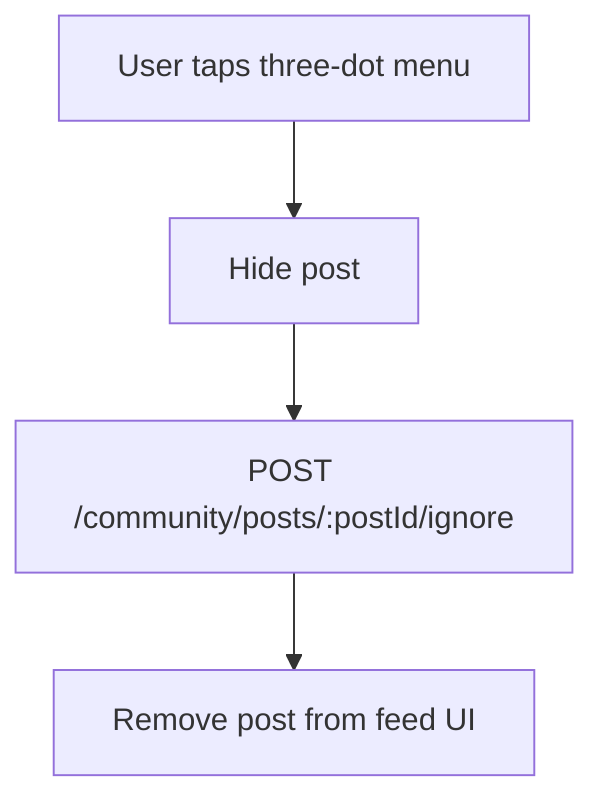
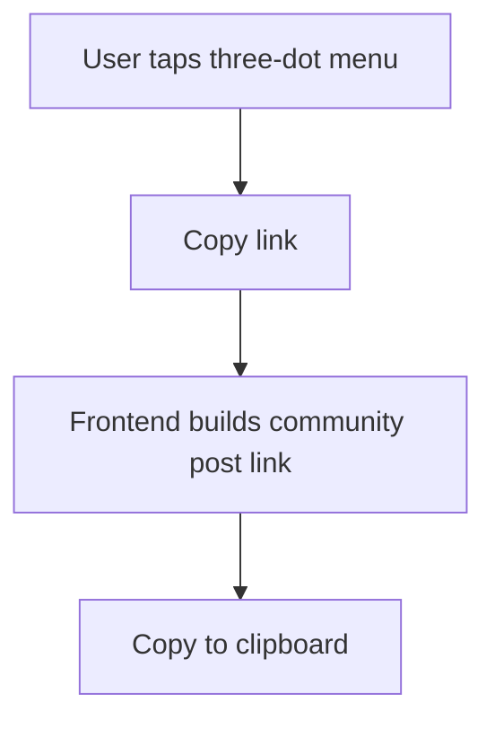

# Community Post Report, Hide, Copy Link — Implementation Plan

This document is the working plan for the Community post three-dot action menu shown in Figma.

## Goal

On each Community feed post, user can open the action menu and choose:

- Report post
- Hide post
- Copy link

The plan below is for backend alignment before implementation.

## Figma Flow

### 1. Action Menu

User taps the three-dot menu on a Community post card.

Options:

- Report post
- Hide post
- Copy link
- Cancel

### 2. Report Post

User selects one reason:

- Spam or irrelevant
- Inappropriate content
- Harassment
- Scam or fraud
- Not food truck related

Then user taps `Submit report`.

After success:

- Show `Report submitted`
- User can optionally tap `Hide this post`
- Or `Back to feed`

### 3. Hide Post

User hides the post from their own feed.

Important:

- This is user-specific.
- It should not delete the post globally.
- Other users can still see the post.

### 4. Copy Link

User copies a shareable/deep link for the post.

Important:

- This may not require a backend mutation.
- If backend already returns post id/details, frontend can build the link.

## Current Backend Status

### Hide Post

Already exists:

```http
POST /api/v1/community/posts/:postId/ignore
```

Purpose:

- Persistently hides the post for current authenticated user.
- Existing backend stores this as `CommunityPostAction` with type `IGNORE`.

Undo also exists:

```http
DELETE /api/v1/community/posts/:postId/ignore
```

Current response:

```json
{
  "message": "Post hidden from your Community feed"
}
```

Decision:

- Reuse this existing API for the Figma `Hide post` button.
- No duplicate hide API needed.

### Copy Link

Currently no dedicated Community post copy-link endpoint is needed.

Recommended frontend link format:

```txt
https://your-frontend-domain.com/community/posts/:postId
```

or app deep link:

```txt
bitedrop://community/posts/:postId
```

Decision:

- Frontend can copy the link directly from the post id.
- Backend does not need to track copy count unless product wants analytics later.

### Report Post

Not implemented yet for Community posts.

Need new backend support.

## Proposed New Report API

### Submit Report

```http
POST /api/v1/community/posts/:postId/reports
```

Purpose:

- Authenticated user reports a Community post.
- Backend stores report reason.
- Backend prevents duplicate active report from the same user for the same post.
- Backend does not automatically hide the post unless frontend also calls hide API.

Request body:

```json
{
  "reason": "SPAM_OR_IRRELEVANT"
}
```

Allowed reason values:

```txt
SPAM_OR_IRRELEVANT
INAPPROPRIATE_CONTENT
HARASSMENT
SCAM_OR_FRAUD
NOT_FOOD_TRUCK_RELATED
```

Success response:

```json
{
  "message": "Report submitted successfully",
  "report": {
    "id": "report-id",
    "postId": "post-id",
    "reason": "SPAM_OR_IRRELEVANT",
    "status": "PENDING",
    "createdAt": "2026-09-15T09:00:00.000Z"
  }
}
```

## Optional Report + Hide Flow

After report success, if user taps `Hide this post`, frontend calls:

```http
POST /api/v1/community/posts/:postId/ignore
```

Recommended frontend sequence:

1. User submits report.
2. Backend returns success.
3. Show report submitted modal.
4. If user taps `Hide this post`, call hide API.
5. Remove post from current feed UI.

## Proposed Database Plan

Add report reason enum:

```prisma
enum CommunityPostReportReason {
  SPAM_OR_IRRELEVANT
  INAPPROPRIATE_CONTENT
  HARASSMENT
  SCAM_OR_FRAUD
  NOT_FOOD_TRUCK_RELATED
}
```

Add report status enum:

```prisma
enum CommunityPostReportStatus {
  PENDING
  REVIEWING
  RESOLVED
  DISMISSED
}
```

Add model:

```prisma
model CommunityPostReport {
  id              String                    @id @default(uuid()) @db.Uuid
  postId          String                    @map("post_id") @db.Uuid
  reportedById    String                    @map("reported_by") @db.Uuid
  reason          CommunityPostReportReason
  status          CommunityPostReportStatus @default(PENDING)
  reviewedById    String?                   @map("reviewed_by") @db.Uuid
  resolutionNotes String?                   @map("resolution_notes")
  reviewedAt      DateTime?                 @map("reviewed_at") @db.Timestamptz(6)
  createdAt       DateTime                  @default(now()) @map("created_at") @db.Timestamptz(6)

  post       CommunityRequest @relation(fields: [postId], references: [id])
  reportedBy User             @relation("CommunityPostReportReportedBy", fields: [reportedById], references: [id])
  reviewedBy User?            @relation("CommunityPostReportReviewedBy", fields: [reviewedById], references: [id])

  @@unique([postId, reportedById])
  @@map("community_post_reports")
}
```

Also add relations:

```prisma
CommunityRequest.reports CommunityPostReport[]
User.communityPostReportsFiled CommunityPostReport[] @relation("CommunityPostReportReportedBy")
User.communityPostReportsReviewed CommunityPostReport[] @relation("CommunityPostReportReviewedBy")
```

## Error Handling Plan

| Case | Status | Message |
|---|---:|---|
| Missing/invalid reason | `400` | `Report reason is required` or validation message |
| Post not found | `404` | `Community post not found` |
| Own post report | `403` | `You cannot report your own post` |
| Duplicate report | `409` | `You have already reported this post` |
| Hidden/deleted post | `404` | `Community post not found` |
| Missing/invalid token | `401` | `Unauthorized` |

## API Mapping For Figma

| Figma action | API | Status |
|---|---|---|
| Open action menu | No API | Frontend only |
| Report post | `POST /api/v1/community/posts/:postId/reports` | Implemented |
| Hide post | `POST /api/v1/community/posts/:postId/ignore` | Already exists |
| Hide after report | `POST /api/v1/community/posts/:postId/ignore` | Already exists |
| Back to feed | No API | Frontend only |
| Copy link | No API needed | Frontend builds/copies link |

## Final Recommended Flow

### Report only



### Report and hide



### Hide directly



### Copy link



## Open Decisions Before Implementation

All decisions below are now confirmed.

1. User cannot report their own post.
2. Report does not automatically hide the post.
3. Copy link is handled from frontend side.
4. Admin review APIs are not needed right now.

## Final Implementation Scope

Implemented scope:

- New Community report storage model/migration.
- New report DTO.
- New report API:

```http
POST /api/v1/community/posts/:postId/reports
```

- Proper error messages.

Do not implement:

- Admin report review APIs.
- Backend copy-link API.
- Auto-hide after report.
- New hide API, because existing ignore API will be reused.
