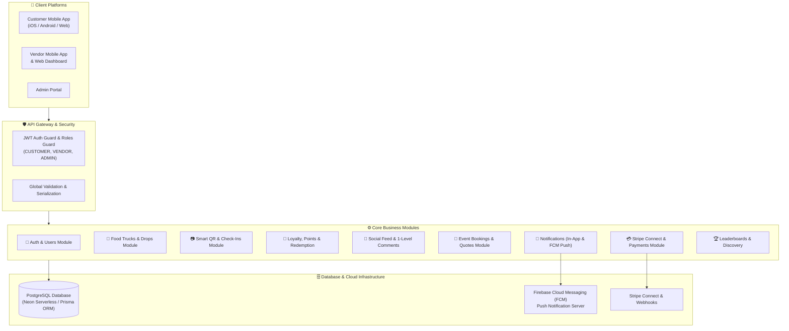
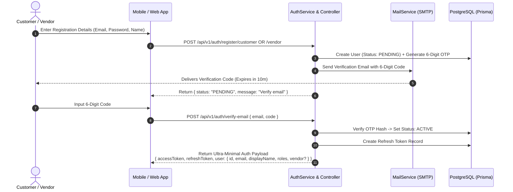
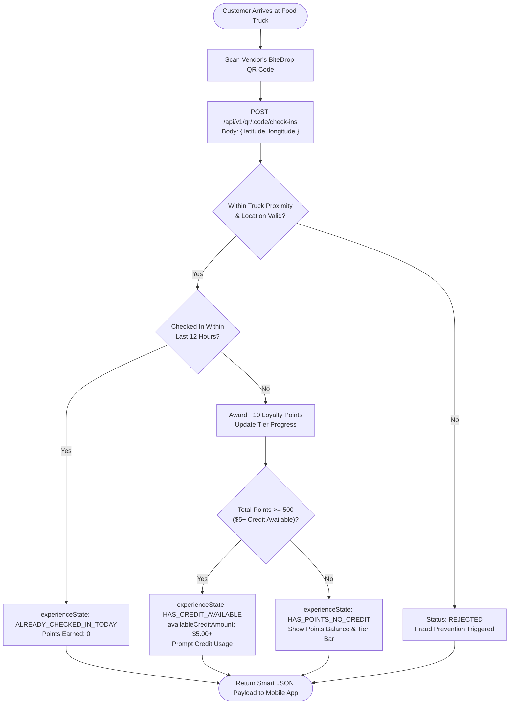
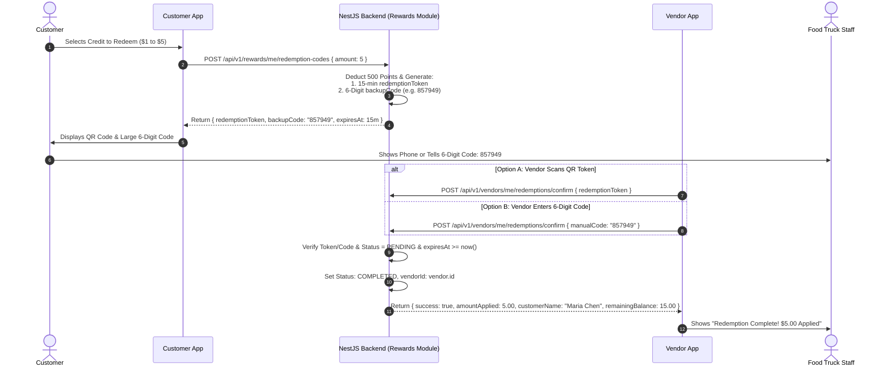
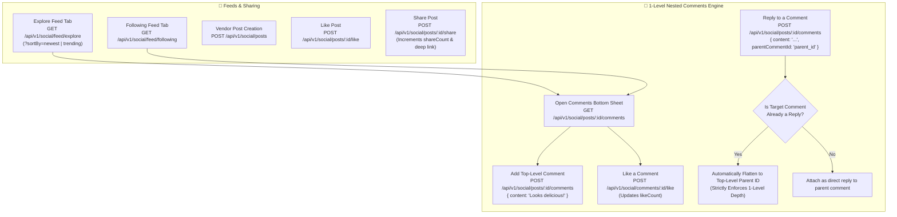
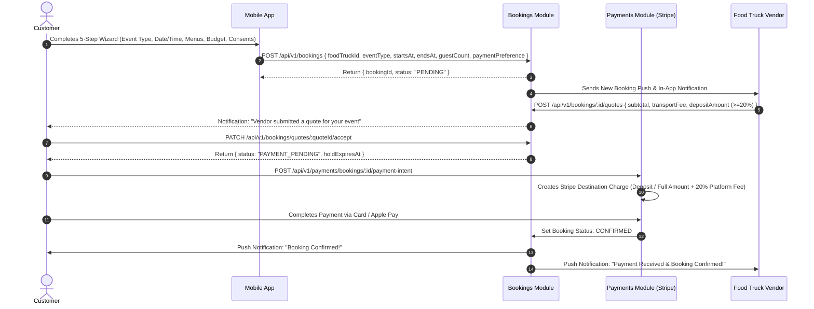
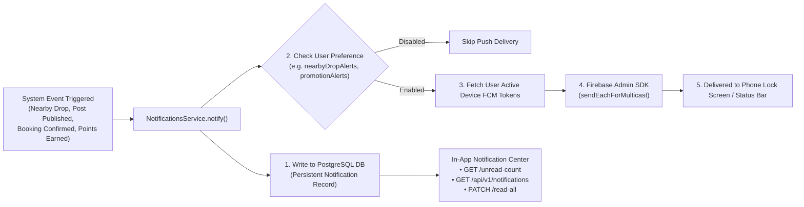

# BiteDrop — Complete System Visual Flowchart & Architecture

This document visualizes all backend workflows, modules, and API data flows implemented to date.

---

## 1. High-Level System Architecture



---

## 2. Authentication & User Onboarding Flow



---

## 3. Food Truck Discovery & Smart QR Check-In Flow



---

## 4. Credit Redemption Flow (6-Digit Backup Code)



---

## 5. Social Feed, 1-Level Comments & Interaction Flow



---

## 6. Event Booking & Payment Split Workflows

For the dedicated, end-to-end multi-diagram document covering all 3 booking types, state machines, and the 20% minimum deposit rule, see [ALL_BOOKING_FLOWS_FLOWCHART.md](file:///Users/softvence/arif/project/christinacormie-backend/docs/ALL_BOOKING_FLOWS_FLOWCHART.md).

### Flow 1: Public Community Request (Open Bidding)
```text
Customer Posts Event in Feed -> Multiple Food Trucks Submit Quotes (Deposit >= 20%) 
-> Customer Accepts Best Quote -> Pays Deposit/Full via Stripe 
-> 20% Platform Fee to BiteDrop, Net to Vendor -> CONFIRMED
```

### Flow 2: Direct Food Truck Profile Booking


---

## 7. Push & In-App Notification Pipeline



---

## 8. Summary of Implemented API Endpoints

| Category | Method | Endpoint | Description |
| :--- | :--- | :--- | :--- |
| **Auth** | `POST` | `/api/v1/auth/register/customer` | Customer registration + 6-digit email OTP |
| **Auth** | `POST` | `/api/v1/auth/register/vendor` | Vendor registration + food truck draft creation |
| **Auth** | `POST` | `/api/v1/auth/verify-email` | Verifies 6-digit email code & activates account |
| **Auth** | `POST` | `/api/v1/auth/login` | Returns ultra-minimal auth payload & tokens |
| **Auth** | `POST` | `/api/v1/auth/logout` | Revokes refresh token |
| **Food Trucks** | `GET` | `/api/v1/food-trucks/drops/nearby` | Proximity live food truck drops |
| **Food Trucks** | `GET` | `/api/v1/food-trucks/profile/:slug` | Public food truck profile & active menu |
| **QR & Check-In** | `GET` | `/api/v1/vendors/me/qr-code` | Vendor food truck QR payload & sharing link |
| **QR & Check-In** | `POST` | `/api/v1/qr/:code/check-ins` | Smart check-in returning experience state & credit |
| **Rewards** | `POST` | `/api/v1/rewards/me/redemption-codes` | Generates 15-min token & 6-digit backup code |
| **Rewards** | `POST` | `/api/v1/vendors/me/redemptions/confirm` | Vendor confirms redemption via QR or 6-digit code |
| **Social** | `GET` | `/api/v1/social/feed/following` | Personalized feed from followed trucks |
| **Social** | `GET` | `/api/v1/social/feed/explore` | Explore feed across all trucks (newest/trending) |
| **Social** | `POST` | `/api/v1/social/posts` | Vendor creates post with media images |
| **Social** | `POST` | `/api/v1/social/posts/:id/like` | Toggle like on post |
| **Social** | `POST` | `/api/v1/social/posts/:id/share` | Share post & increment shareCount |
| **Social** | `GET` | `/api/v1/social/posts/:id/comments` | Fetch comments tree with 1-level nested replies |
| **Social** | `POST` | `/api/v1/social/posts/:id/comments` | Add comment or 1-level reply (auto-flattened) |
| **Social** | `POST` | `/api/v1/social/comments/:id/like` | Toggle like on a comment |
| **Bookings** | `POST` | `/api/v1/bookings` | Customer 5-step event booking request |
| **Bookings** | `POST` | `/api/v1/bookings/:id/quotes` | Vendor submits event quote |
| **Bookings** | `PATCH` | `/api/v1/bookings/:id/accept` | Accept booking request |
| **Payments** | `POST` | `/api/v1/payments/bookings/:id/payment-intent` | Stripe payment intent for booking |
| **Notifications**| `GET` | `/api/v1/notifications` | User notification list (All / Unread filter) |
| **Notifications**| `GET` | `/api/v1/notifications/unread-count` | Real-time unread badge counter |
| **Notifications**| `PATCH` | `/api/v1/notifications/read-all` | "Mark all read" button |
| **Notifications**| `POST` | `/api/v1/users/me/device-tokens` | Register FCM push token from device |
| **Leaderboards** | `GET` | `/api/v1/leaderboards/top-rated` | Top rated food trucks |
| **Leaderboards** | `GET` | `/api/v1/leaderboards/trending` | Trending food trucks in city |
